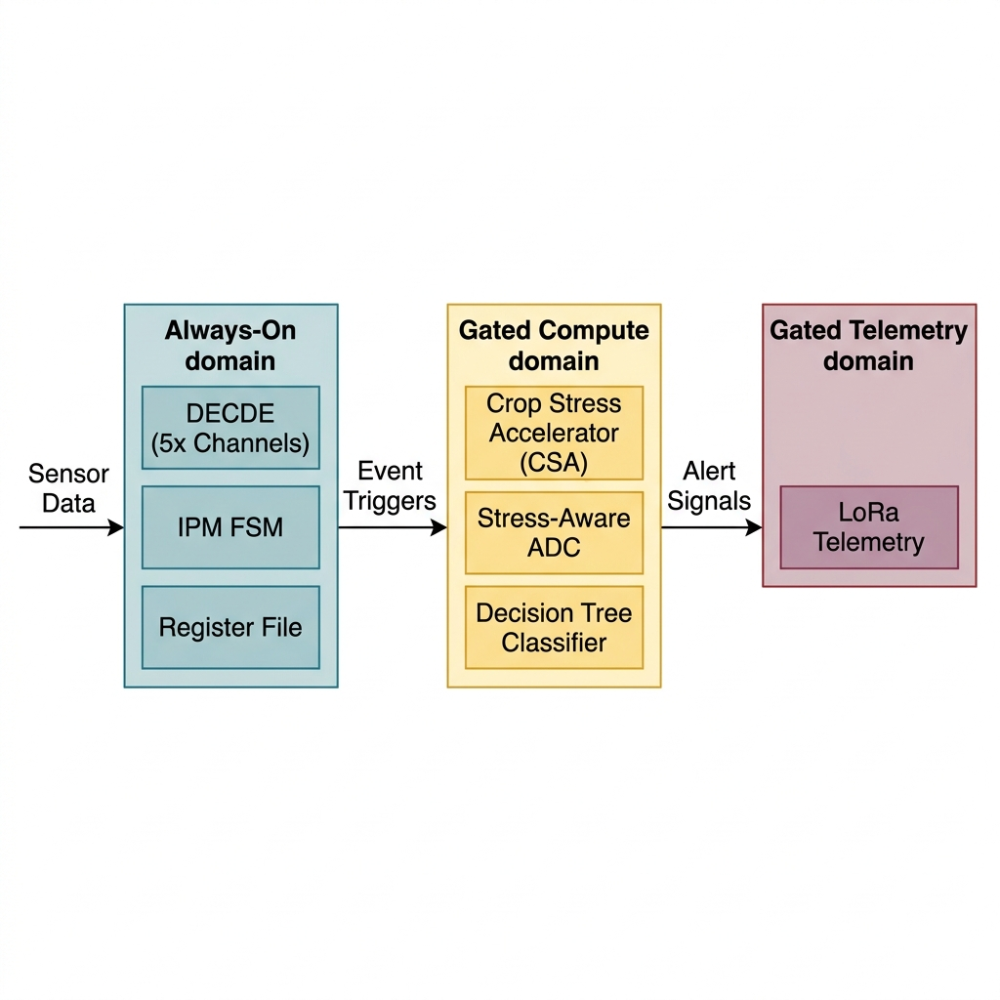
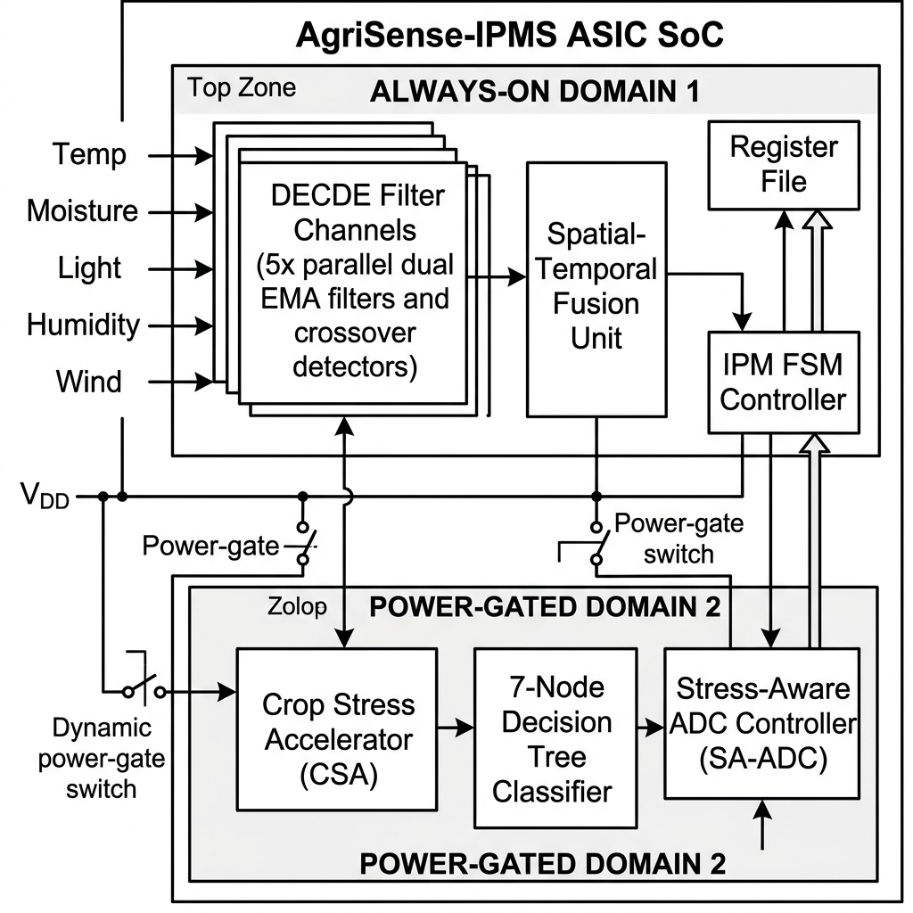
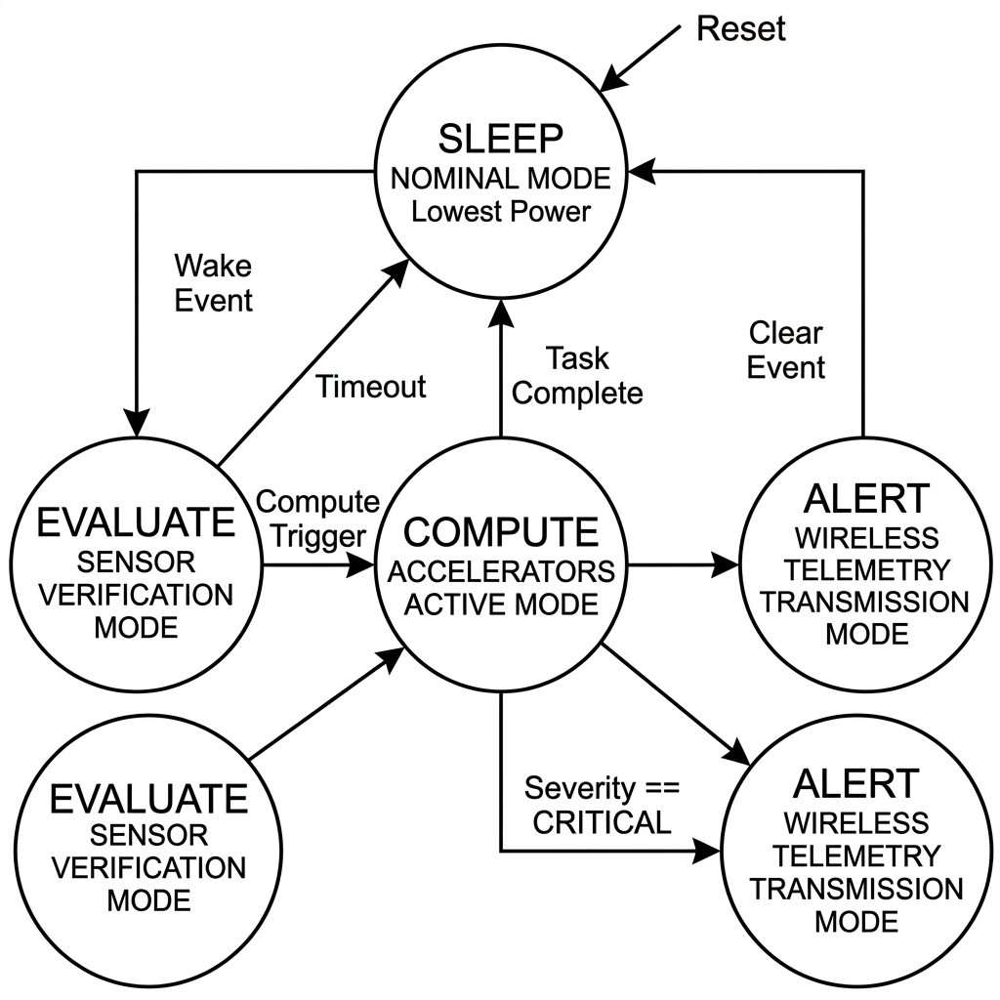
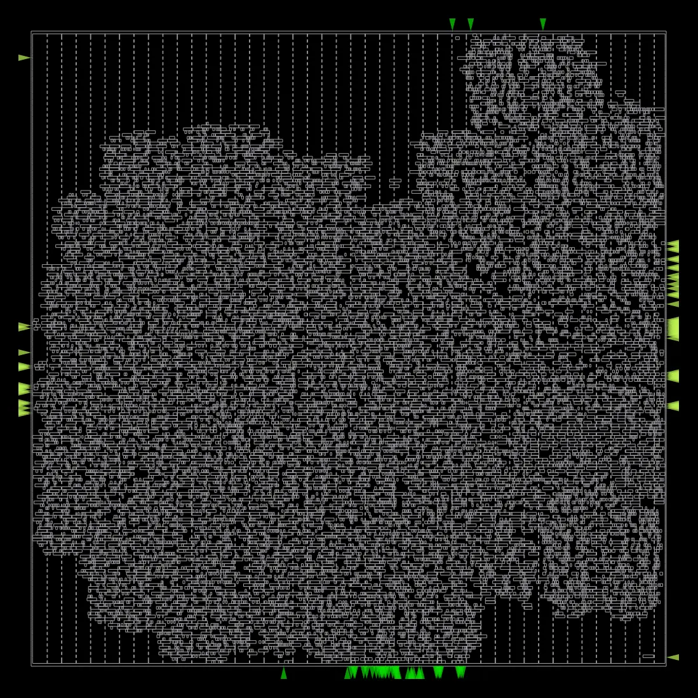
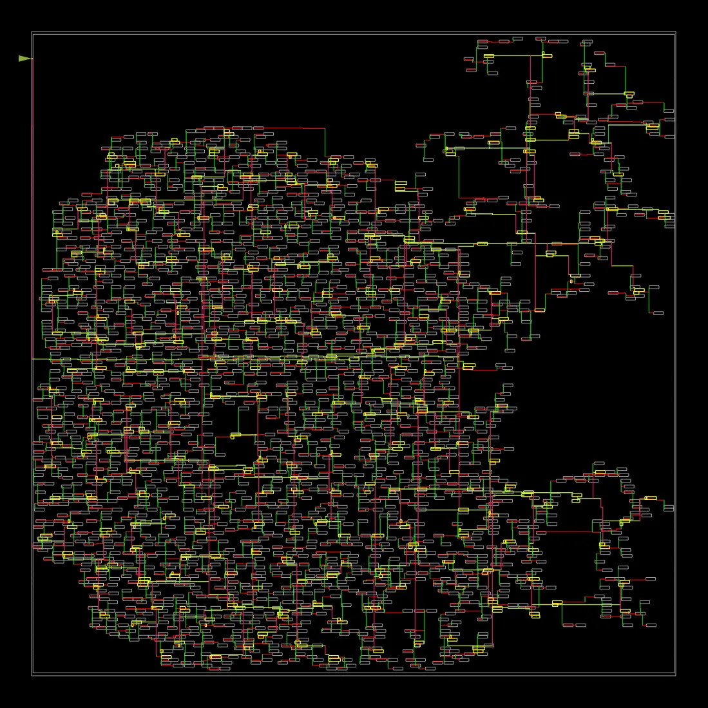
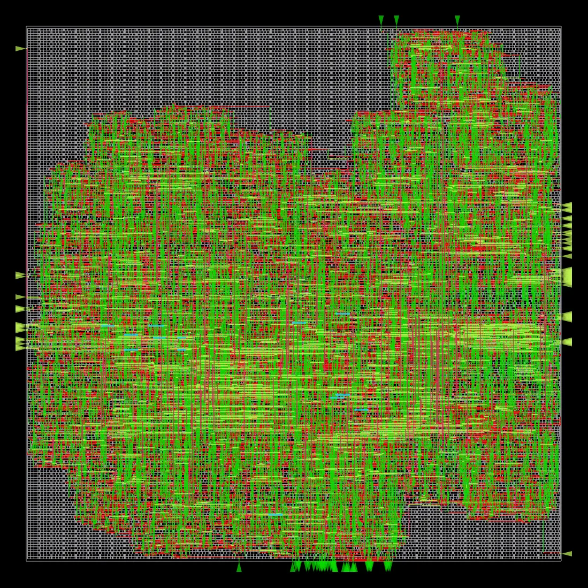
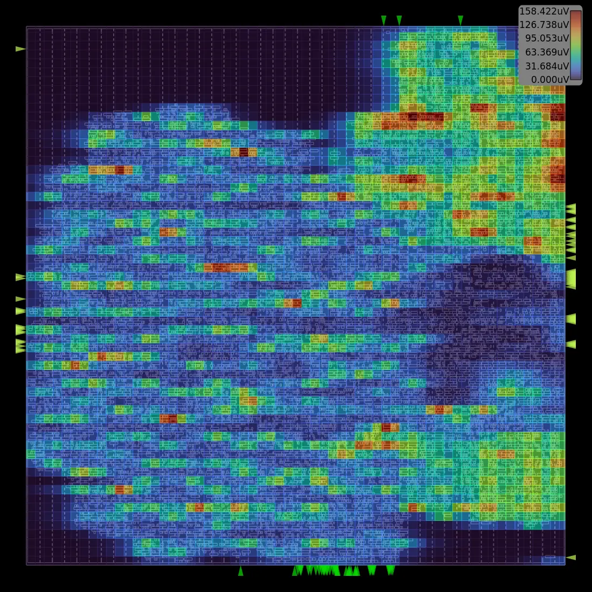
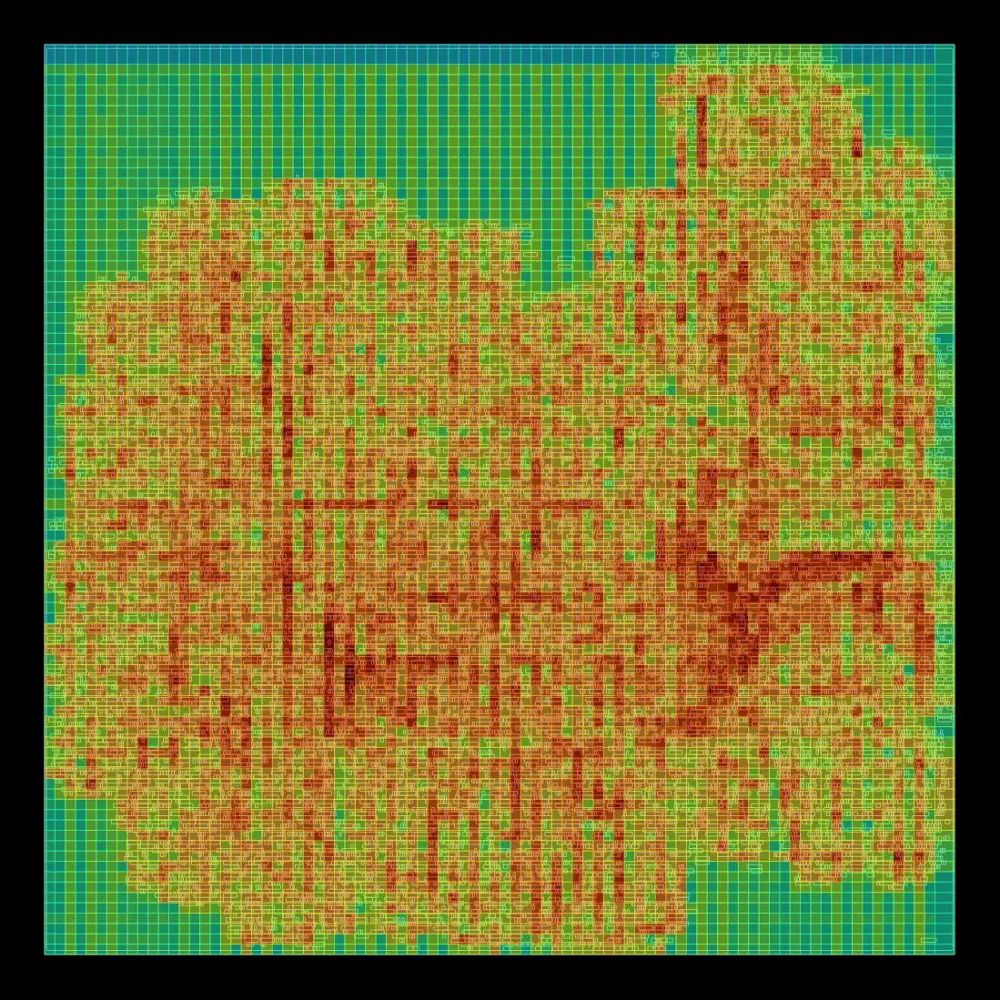
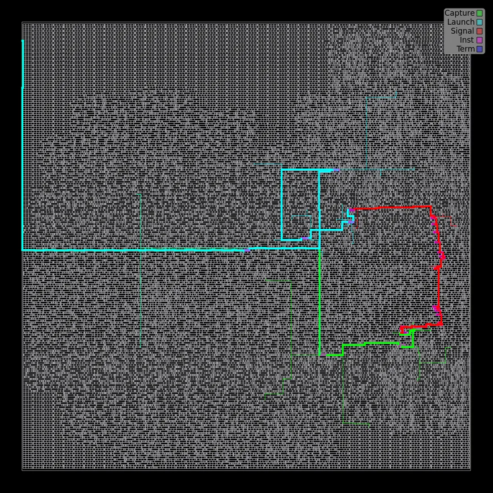

# AgriSense-IPMS
## Intelligent Power Management SoC for Precision Agriculture
### RTL v1.0 — `rtl_v1_0_freeze` — IEEE WinTechCon 2026 Submission

[](#)
[](#)
[](#)
[](#)

---

## 1. Overview & Power-Gating Hierarchy

**AgriSense-IPMS** is a highly energy-efficient, synthesizable ASIC architecture designed for autonomous, long-term **crop-stress monitoring** in precision agriculture. 

To maximize battery lifetime in remote field deployments, the SoC implements a **Hierarchical Wake Pipeline**. Instead of running power-hungry sensor analog-to-digital converters (ADCs), machine learning classification engines, and wireless transmitters continuously, AgriSense-IPMS divides the design into three power domains that activate progressively based on detected agricultural event severity:

1. **Domain 1 (Always-On — $\mu$W range):** Houses the sensor register file, the Intelligent Power Management (IPM) FSM, and 5 parallel Digital Edge & Crossover Detection Engine (DECDE) channels. These channels run lightweight Exponential Moving Average (EMA) filters to screen noise.
2. **Domain 2 (Power-Gated — mW range, event-driven):** Contains the Crop Stress Accelerator (CSA) for weighted feature fusion, a 7-node programmable Decision Tree (DT) classifier, and the Stress-Aware ADC (SA-ADC) controller.
3. **Domain 3 (Power-Gated — mW range, alert-driven):** Contains the telemetry transmission interfaces (e.g., LoRa).

<p align="center">
  
  <br>
  <em>Figure 1: Power Domain partitioning indicating the transition from Always-On monitoring to event-driven compute and wireless telemetry.</em>
</p>

---

## 2. Hardware Architecture & Key Contributions

The core processor incorporates three key hardware contributions designed to minimize energy consumption:

*   **Contribution 1: Stress-Aware Adaptive ADC (SA-ADC) Controller**
    Adjusts the sampling resolution dynamically between 8-bit, 10-bit, and 12-bit based on the current environmental stress severity, avoiding power dissipation from unnecessary quantization levels.
*   **Contribution 2: DECDE-Fusion Pipeline**
    Integrates 5 independent sensor processing channels (temperature, soil moisture, ambient light, humidity, and wind speed). Each channel features dual fast/slow EMA filters and a crossover detector feeding a direction-aware spatial-temporal fusion unit.
*   **Contribution 3: Programmable Decision Tree Classifier**
    Provides a low-power, non-linear classification engine with 7 programmable node thresholds ($T_0$ to $T_6$) to classify the stress level (Nominal, Warning, Critical) and identify the specific stress type.

<p align="center">
  
  <br>
  <em>Figure 2: Comprehensive system architecture of the AgriSense-IPMS SoC, detailing Domain 1 (Always-On) and Domain 2/3 (Gated) sub-modules.</em>
</p>

The global sleep, wake, and power gating cycles are coordinated by the **Intelligent Power Management (IPM) FSM** featuring a robust 2-cycle hysteresis to prevent oscillatory domain-activation thrashing:

<p align="center">
  
  <br>
  <em>Figure 3: State transition diagram of the Intelligent Power Management (IPM) controller.</em>
</p>

---

## 3. ASIC Physical Design & PnR Results (Sky130HD)

AgriSense-IPMS has successfully completed the full physical implementation flow (RTL-to-GDSII) on the **SkyWater 130nm High-Density (Sky130HD)** standard cell technology library using the OpenLane/OpenROAD ASIC toolchain.

### Final Signoff Metrics
| Parameter | Value | Description |
| :--- | :---: | :--- |
| **Technology** | SkyWater 130nm HD | Target standard cell library node |
| **Core Silicon Area** | 143,334 $\mu m^2$ ($0.143\text{ mm}^2$) | Active boundary footprint |
| **Placement Density** | 39.5% | Standard cell utilization ratio |
| **Maximum Frequency ($F_{max}$)** | 116.15 MHz | Closed at target speed constraint |
| **Setup & Hold Slack** | 0.00 ns / 0.00 ns | Zero timing violations (WNS/TNS = 0.00) |
| **Total Signoff Power** | 34.1 mW | Peak dynamic and static power dissipation |
| **Leakage Power** | 71.8 nW | Standby leakage floor |
| **DRC / Antenna Violations** | 0 / 0 | Fully verified and clean signoff status |
| **Total Standard Cells** | 58,891 | Includes fill/tap cells and clock tree buffers |

### Layout Analysis Reports

The following screenshots represent the final physical design layouts extracted from the signoff databases:

| **Cell Placement & Buffering** | **Clock Tree Synthesis (CTS) Network** |
| :---: | :---: |
|  <br> *Figure 4: Standard cell density distribution post-placement.* |  <br> *Figure 5: CTS clock buffer tree and global routing trunks.* |
| **Detailed Routed Layout** | **IR Drop Analysis** |
|  <br> *Figure 6: Global and detailed routing layout (all metal layers).* |  <br> *Figure 7: Static voltage-drop map verifying power grid integrity.* |
| **Routing Track Congestion** | **Critical Worst Timing Path** |
|  <br> *Figure 8: Routing density map demonstrating zero congestion hot-spots.* |  <br> *Figure 9: Critical setup-timing path routed through the CSA multiplier.* |

---

## 4. Repository Structure

```
AgriSense-IPMS/
├── rtl/                          # Synthesizable ASIC RTL Code
│   ├── common/                   # Register file, buses, synchronizers, isolation cells
│   ├── decde/                    # EMA filters, crossover detectors, fusion unit
│   ├── csa/                      # Weighted sum arithmetic, normalizers, CSA
│   ├── dt/                       # 7-node programmable Decision Tree classifier
│   ├── ipm/                      # IPM FSM, power gating controller, wake-up manager
│   ├── sa_adc/                   # Adaptive-resolution Stress-Aware ADC controller
│   └── top/                      # Top-level integration (agrisense_ipms_top.v)
├── tb/                           # Complete Verification Suite
│   ├── tb_top.v                  # System-level testbench for agricultural scenarios
│   ├── tb_dwell_report.v         # Energy-savings dwell-time analyzer
│   └── tb_[module].v             # Individual block-level unit testbenches
├── docs/                         # Specification and Architecture Documentation
│   ├── figures/                  # SVG/PNG schematic diagrams and state maps
│   ├── comparison_table.md       # Comparative study vs MCU/FPGA platforms
│   └── register_map.md           # Register bit-fields and address space definitions
├── sim/                          # Simulation Traces and Environments
│   ├── scripts/                  # generate_traces.py (sensor simulation data)
│   └── traces/                   # Synthetic environmental data (6 event scenarios)
├── paper_results/                # PnR Layout Visualizations & GDS database verification
├── synth/                        # OpenROAD/OpenLane Physical Design Environment
│   ├── openroad_freeze/          # Locked RTL repository snapshot
│   ├── openlane/                 # Synthesis, timing constraints, and PnR flow configurations
│   └── reports/                  # Post-PnR signoff reports (Area, Power, Timing)
└── .devcontainer/                # Development Container setup for OSS-CAD-Suite
```

---

## 5. Register Map Summary

All control parameters, weights, and sensor metrics are mapped to a unified register bus accessible via a standard processor interface:

| Address Range | Block | Key Registers | Functionality |
| :--- | :--- | :--- | :--- |
| `0x00–0x0F` | Sensor Interface | `0x00` - `0x09` | Read-only real-time and latched sensor readings |
| `0x10–0x1F` | CSA Config | `0x10` - `0x15`, `0x1A` | Feature weights and weight invariant status |
| `0x20–0x4F` | DECDE Config | `0x20` - `0x29` | Fast and slow EMA filter shift factors |
| `0x50–0x5F` | Fusion Config | `0x50` - `0x56` | Temporal window parameters, voting threshold |
| `0x60–0x7F` | Decision Tree | `0x60` - `0x6D` | Programmable node thresholds ($T_0$ to $T_6$) and output status |
| `0x80–0x9F` | SA-ADC Config | `0x80` - `0x8F` | Per-channel stress thresholds and battery constraints |
| `0xA0–0xAF` | IPM Controller | `0xA0`, `0xA1` | FSM current state, override flags, power-gate controls |

---

## 6. Simulation & Verification Quickstart

### Vivado RTL Regression Simulation
Compile and execute the regression suite containing 6 real-world agricultural scenarios (nominal weather, sudden heatwave, progressive drought, flash windstorm, sensor failure, and recovering soil moisture):

```powershell
# 1. Compile the complete RTL database and verification scripts
xvlog -i rtl/common `
  rtl/common/isolation_cell.v rtl/common/reg_bus_interconnect.v `
  rtl/common/register_file.v rtl/common/synchronizer.v `
  rtl/decde/ema_filter.v rtl/decde/crossover_detector.v `
  rtl/decde/decde_channel.v rtl/decde/fusion_unit.v `
  rtl/csa/weighted_sum.v rtl/csa/normalization_unit.v `
  rtl/csa/crop_stress_accelerator.v `
  rtl/dt/decision_tree_accelerator.v `
  rtl/ipm/ipm_fsm.v rtl/ipm/power_controller.v rtl/ipm/wake_controller.v `
  rtl/sa_adc/sa_adc_controller.v `
  rtl/top/agrisense_ipms_top.v `
  tb/tb_top.v

# 2. Elaborate and launch the simulator
xelab -top tb_top -snapshot tb_top_snap
xsim tb_top_snap -runall
```

To reconstruct or modify the sensor trace scenarios:
```bash
python sim/scripts/generate_traces.py
```

### Institutional Cadence Toolflows (Genus / Innovus)
For academic and laboratory settings utilizing industrial Cadence toolsets, pre-configured synthesis and layout script templates for **45nm** and **90nm** technologies are located in the [AgriSense-IPMS-Cadence/](file:///c:/Users/Home/Downloads/PROJECTS/PMIC%20AGRITECH/AgriSense-IPMS/AgriSense-IPMS-Cadence/) subfolder. Refer to its nested documentation for directory configurations and design setups.

---

## 7. Citation

If you use this work, please cite the following publication:

```bibtex
@inproceedings{agrisense_ipms_2026,
  title     = {AgriSense-IPMS: A Hierarchical Wake Pipeline ASIC for Energy-Efficient Crop Stress Monitoring},
  author    = {Niranjan B., Aashish},
  booktitle = {Proceedings of IEEE WinTechCon 2026},
  year      = {2026}
  note      = {RTL v1.0 frozen at tag rtl_v1_0_freeze}
}
```
