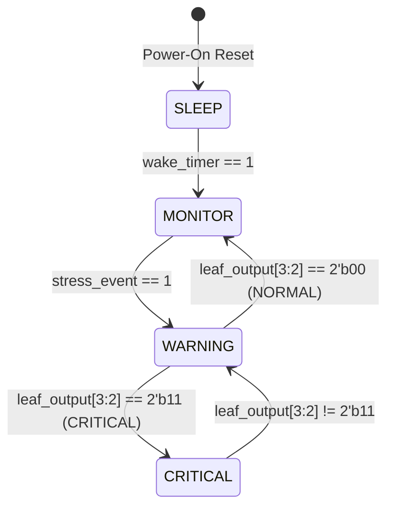

# Intelligent Power Manager (IPM) FSM Specification

## Overview
The IPM FSM dictates the operating state of the chip. It manages power gates and clock enables for the three primary power domains:
*   **Domain 1 (Always-On / Event Detection)**
*   **Domain 2 (Compute / Stress Classification)**
*   **Domain 3 (Transceiver Communication)**

---

## State Diagram & Definition

### State Encoding
| State Constant | Binary Code | Power Profile Description |
|:---|:---|:---|
| `IPM_SLEEP` | `2'b00` | Minimum power. All blocks disabled except Always-On timers/FSM. |
| `IPM_MONITOR` | `2'b01` | Event detection active. Sensors, SIE, and DECDE filters active. |
| `IPM_WARNING` | `2'b10` | Compute active. Domain 2 powered up. CSA and Decision Tree active. |
| `IPM_CRITICAL` | `2'b11` | Transceiver active. Domain 2 and Domain 3 powered up. LoRa active. |

---

## State Transition Table

| Current State | Input Condition | Next State | Triggering Mechanism |
|:---|:---|:---|:---|
| `IPM_SLEEP` | `wake_timer == 1` | `IPM_MONITOR` | Timer wakeup pulse from external Always-On timer. |
| `IPM_SLEEP` | `wake_timer == 0` | `IPM_SLEEP` | Stay asleep. |
| `IPM_MONITOR` | `stress_event == 1` | `IPM_WARNING` | Fusion Unit detects co-occurring crossover trend events. |
| `IPM_MONITOR` | `stress_event == 0` | `IPM_MONITOR` | Stay in event-monitoring mode. |
| `IPM_WARNING` | `leaf_output[3:2] == 2'b11` | `IPM_CRITICAL` | Decision Tree classifies stress severity as Critical. |
| `IPM_WARNING` | `leaf_output[3:2] == 2'b00` | `IPM_MONITOR` | Environment recovered (Normal severity); return to event-monitoring. |
| `IPM_WARNING` | Otherwise | `IPM_WARNING` | Keep evaluating Domain 2 accelerators (severity 01 or 10). |
| `IPM_CRITICAL` | `leaf_output[3:2] != 2'b11` | `IPM_WARNING` | Crop recovery to lower severity; disable LoRa transceiver to save power. |
| `IPM_CRITICAL` | Otherwise | `IPM_CRITICAL` | Keep reporting critical alerts. |

---

## Power Domain Control Outputs

| State | sensor_en | decde_en | domain2_pwr_en | csa_en | dtree_en | domain3_pwr_en | comm_en |
|:---|:---:|:---:|:---:|:---:|:---:|:---:|:---:|
| `IPM_SLEEP` | 0 | 0 | 0 | 0 | 0 | 0 | 0 |
| `IPM_MONITOR` | 1 | 1 | 0 | 0 | 0 | 0 | 0 |
| `IPM_WARNING` | 1 | 1 | 1 | 1 | 1 | 0 | 0 |
| `IPM_CRITICAL` | 1 | 1 | 1 | 1 | 1 | 1 | 1 |
